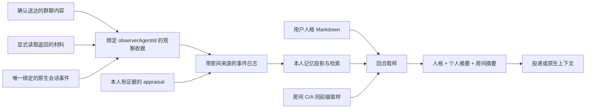

# Agent 身份、人格与记忆

这份文档定义当前插件的记忆边界。Agent 的持续身份是个人记忆的归属；房间是共享协作上下文；DSH Session 是执行载体。三个标识不能互相代替。

## 领域对象

| 对象 | 负责什么 | 不代表什么 |
| --- | --- | --- |
| Agent | 稳定 `agentId`、人格 Markdown、本人观察和判断的归属 | 当前任务、某一房间职务或单个 Session |
| Participation | Agent 在房间中的参与关系与 Session 绑定 | 本人看过该房间全部历史 |
| Persona | 用户设定的性格、偏好、习惯和稳定背景 | 权限、事实证据、自动生成的心理诊断 |
| Room | 共享消息、章程、台账、投递、回合与事件日志 | 所有成员的共同私人记忆 |
| Observation | 某身份实际获得一份材料的收据 | 材料必然正确、永远完整或构成新指令 |
| Appraisal | 某身份对另一身份的主张、立场、把握与证据 | 房间客观事实或 C 计数 |

同一身份可在不同工作中使用不同 Session。Session 被另一身份复用时，历史参与关系保留，不能用新的群组默认配置重写过去的身份。缺少明确归属且历史存在多个候选身份时，迁移或个人读取拒绝猜测。房间调用使用当前参与关系；不带房间的原生上下文只接受唯一身份绑定。

## 模块职责

| 模块 | 边界 |
| --- | --- |
| `lib/agent-directory.js` | 稳定身份、参与历史、身份兼容规则、当前 appraisal 可见性与可引用证据集合 |
| `lib/agent-persona.js` | 每身份一份人格文件、内容哈希比较、旧版本留存与同进程保存排序 |
| `lib/agent-memory.js` | 模型可见事件文本抽取、纯函数投影本人已观察经历与判断、检索排序、600 码元个人摘要 |
| `lib/relationship.js` | 房间 C 计数、A 有效区间及版本化干预的纯函数重放 |
| `lib/experiment.js` | 同一日志前缀的 C/A 取样、房间摘要、配置指纹和观测指标定义 |
| `lib/room-journal.js` | 状态提交、审计发布、恢复排序、当前房间授权边界和一致读取 |
| `lib/event-log.js` | JSONL 与 head anchor 的单实例读写排序、事件信封、哈希链与健康计数 |
| `lib/room-store.js` | 编排生命周期、身份解析、来源选择、观察收据、工具和提示词集成 |
| `lib/index.js` | HTTP/工具注册，以及可选的 DSH 原生提示词组装钩子 |
| `scripts/relationship-eval.mjs` | 只读描述性报告、有效测量与覆盖检查；不作因果识别 |

## 从观察到下一次调用



### 观察来源

- 群聊投递确认到达后，收据记录本次提示词包含的消息 id。构造提示词、记下成本或调用 transport 均不单独证明成员收到。
- `chat_memory` 记录实际返回的近期消息、台账、提案与章程。`chat_read_document` 记录实际返回片段的内容哈希、行号和截断信息。工具返回 `memoryReceipt`，说明收据是否写成。
- 本人提交的群聊消息记录为亲历输出。
- `tool/result` 中实际提供给模型的文本也可记忆，包括嵌套的 `tool-result` 文本块。活动群聊中的结果绑定当前接收者；原生路径要求 Session 历史唯一绑定某 Agent。
- 插件实际收到的原生 `user/message`、`assistant/message` 和 `tool/result` 文本，在没有活动群聊投递时进入该身份的原生来源。宿主动态上下文属于实际收到的文字，但本插件自己的注入区块被排除，避免把摘要回流为新经历。不追溯导入完整原生历史。
- 不抽取工具调用参数、隐藏元数据、推理文本或图片字节，也不扫描屏幕和未观察的私人频道。已知的个人查询工具结果被排除；`chat_memory` / `chat_read_document` 使用各自的结构化收据，避免重复记忆。

只选择该身份参与过的房间及其专属原生来源；事件的 `provenance.roomId` 还必须与读取来源相符。缺少或冲突的来源标记不进入个人投影。参加过某房间只是允许检查该来源，实际材料仍须有本人观察收据。旧日志没有收据时不制造过去的接触事实。

文档及会话事件观察的存储摘录最多 20,000 码元，`chat_memory` 的单个结构化材料摘要最多 2000 码元；个人查询中的每条经历文本最多 2000 码元，并保留截断标记。查询最多 2000 码元，`limit` 为 1–100，分别限制经历和判断；全量条目数仍在 `totals` 中。

当前检索按查询文本匹配、相关对象和事件时间戳排序，再按来源与证据 id 确定稳定顺序。它是可重算的文本检索，没有向量索引、自动总结或记忆巩固。时间戳来自各来源日志，不承诺跨 Session 的全局因果顺序。日志来源不可读或链校验失败时省略该来源并返回 `partial`；没有收据的内容也可能是记录缺口，不能据此证明 Agent 从未见过。

### 主观判断与证据

`chat_appraise` 从工具执行 Session 解析身份，不接受调用方伪造观察者。新事件同时保存历史 Session 字段及 `observerAgentId` / `targetAgentId`。记录和撤销都要求当前房间的有效群聊回合，且在追加前重新验证房间未被恢复替换、回合授权仍成立。

可引用的证据来自同一房间内本人已观察的允许材料，或本人署名消息及本人的 appraisal。观察收据可提供材料 id 和消息 id；消息事件信封 id 也是同一材料的别名。别人的私人 appraisal 不因知道其 id 或伪造引用关系而成为可引用证据。其他房间的个人回忆仍可作为背景，但不能直接作为当前房间 `chat_appraise` 的证据 id。

撤销是追加新事件，关闭当前判断的有效区间；原事件保留。当前房间的 A 投影过滤已换绑的观察者和对象。个人长期投影先按稳定观察者与对象身份分隔，再重放有效区间，因此另一个人复用同一 Session 不会覆盖过去对原对象的判断。缺少稳定身份的旧 A 只在历史 Session 归属无歧义的房间兼容读取，不自动进入跨工作个人记忆。禁止自评与任务独立验收也按稳定身份检查，换一个 Session 不等于换一位验收人。

C 计数只读房间消息、投递和台账等运作事件。它按目标记录十项事实，同一目标在各观察者行下相同；A 是每位观察者自己表达的判断。A 不反写 C，也不会自动改写人格。

## 人格文件与编辑

存储位置相对于状态目录：

```text
rooms.json
events/
  <roomId>.jsonl
  <roomId>.jsonl.head
  agent-observations-<SHA-256(agentId)>.jsonl
  agent-observations-<SHA-256(agentId)>.jsonl.head
agents/
  <SHA-256(agentId)>/
    PERSONA.md
    history/<旧内容哈希>.md
```

人格最多 8000 个 UTF-16 码元。首次读取可创建待填写模板；模板不作为已配置人格注入。Agent 名册中人格编辑器与职务/模型设置分开，未保存草稿保存在浏览器本地。保存请求必须包含读到的 `expectedHash`；版本不符返回冲突，编辑器保留草稿供比较。成功保存前按旧内容哈希留档，再用临时文件替换当前 Markdown。

`GET /api/dsh-chat-local/agents/:id/persona` 与同路径 `POST` 是用户管理接口。`chat_identity` 只读取执行者本人的身份和人格，不暴露任意身份选择或人格修改工具。修改人格改变后续取样及配置哈希，不回写已记录的提示词。

这些文件是普通本地 Markdown，不加密；同进程编辑有内容哈希保护，不承诺多个写入进程的文件事务。手工编辑者仍须自行处理并发改动和备份。

## 注入契约

一次群聊回合只对共享前缀作一次 C/A 取样，也在该次取样读取参与者人格与个人记忆。各成员提示词中的私人部分分别由本人数据渲染；后发言成员不会因前者已更新日志而重新取一份本回合样本。治理门读取同一次 C 采样，开关默认关闭，只能收紧既有权限。

| 内容 | 独立上限 | 审计 |
| --- | --- | --- |
| 房间 C/A 摘要 | 600 UTF-16 码元 | 文本哈希、字符数、所选和省略条目 |
| 本人经历/判断摘要 | 600 UTF-16 码元 | 来源/证据、所选条目、截断和省略原因 |
| 已配置人格 Markdown | 8000 UTF-16 码元 | 人格哈希、注入字符数 |
| 整体群聊提示词 | 没有上述三项合计的硬上限 | 原样 `turn.prompt`、提示词哈希和长度 |

没有可用或能放下的条目时不注入空标题；含义不能脱离对象和证据单独截取。`personalMemory` 默认开启，关闭时停用个人查询/注入与原生观察收集，不删除已有资料，群聊审计收据仍保留。`appraisalDigest` 默认开启，关闭后不自动注入主观判断，但不删除判断或禁止显式查询。

支持 `systemPrompt` 服务的宿主，通过 `system-prompt/assemble` 在普通原生回合组装同一人的人格与个人记忆。该钩子跳过活动群聊投递和身份歧义，同一原生回合复用取样。旧宿主缺少服务时不注册钩子，群聊和显式个人工具仍工作。原生钩子不生成群聊的 `turn.prompt` / `injection.cost` 实验观测。

## 状态与审计的提交边界

`RoomJournal` 集中维护三条规则：

1. `commit(state)` 在没有活动恢复时同步捕获状态和审计内容；活动恢复期间等其提交或回滚后捕获，固定操作 id，将两者一起写入状态格式 17 的文档。临时文件同步后重命名并同步目录；`_journal` 保存尚未确认的操作及校验值。状态写成功才发布事件，失败则保留义务；后续保存及启动恢复重放同一内容，`appendOnce` 防止重复计数。确认后的检查点使用最新已保存状态，不能把较新的提交覆盖回旧版本。
2. 同一房间后续事件不能越过未发布的前项。`appendChecked(room, event, validate)` 等待恢复和前项，再核验当前房间和授权。最终检查与事件加入写队列之间没有 `await`；旧回合不能向恢复后的历史写入。人格、回忆、关系读取及评价写入固定请求开始时的 Agent、房间对象和执行回合，等待后重验；不能借接任者身份或新回合权限。需要权威性成功的调用检查追加结果，不把 `null` 当成成功 id。
3. 恢复通过 `runRestore` 在安装暂态房间前全局排队；同房间恢复和一致快照再通过 `runRoom` 排队。低层 `restore` 拒绝未经该入口协调的重叠恢复。关闭后尚未安装状态的恢复会被拒绝，已开始的状态／日志替换完成清理。恢复将目标房间状态与完整日志替换义务一起保存，并有意取代该房间较旧的待发布操作。日志替换使用操作收据，重启重放不会重复替换并覆盖其后新事件。替换 gate 先释放，再等待其余审计，避免循环等待；resolver 不对调用方开放。

`EventLog.read`、`append`、`replace` 在同一实例中共用每房间队列。写入前先持久保存带校验的 `.pending` 意图，记录确切事件、原字节前缀和目标；恢复仅修复匹配意图的部分写入，不猜测无关损坏。日志、head、收据及其目录执行同步。公共读取遇到未完成意图拒绝；恢复只由明确的写入或启动路径执行。暖缓存同时检查日志和 head 的元数据。

`readEvents` 等待已开始的发布，不等待尚未发布的状态提交，首个工具可在投递状态保存期间读取已经持久化的提示词收据。当前已提交义务无法发布时返回错误。`/health` 将这类状态报告为 `recovery_pending`，列出日志意图、状态义务、检查点及目录同步错误。只读校验和评测脚本拒绝仍有相关义务的状态，不在读取时自行恢复。

`readRoomMemory(roomId)` 等已发布的状态/审计工作结束，从磁盘读取房间和事件，并检查提交 generation。跨过新提交则重试；持续变化超过重试上限时返回错误，不能混用活对象与旧日志。`snapshotRun` 使用这份一致结果。一次失败保存造成的内存脏状态不会被当作已提交状态导出。

这些是**单服务实例的并发与进程中断恢复契约**。独立文件可暂时不一致，但在暴露状态前先恢复已记录义务；存储不可用或记录损坏时拒绝启动。没有跨进程锁，未验证硬件断电、控制器或网络文件系统的保证。直接观察在写入意图持久化前可丢失，外部模型发送与本地日志不是同一事务；不能据提示词留档推断模型实际收到。旧版已漏记的事实无法补造。快照恢复有意丢弃其后的该房间状态和事件，不覆盖人格、其他房间或原生 Session。全状态备份应在停写时覆盖整个状态目录。

## reset 与描述性评测

manifest 划分 run；run 是日志片段，不是独立实验单位。`persistent` 使用累积窗口。`reset_per_episode` 对每个 `(run, 根消息)` 追加一次版本化 `memoryScope: "all"` 清除事件：C/A 重新开窗，该条件的个人查询和注入只取本房间、当前 episode 后的观察。重试同一根消息不重复清除；新 manifest 下的根消息重新计入新 run。

人工干预默认只影响 C。整房间 `clear` 加 `memoryScope: "all"` 才影响 C/A 和该房间个人观察窗口，不能同时指定 `observerId` 或 `targetId`。观察时间以收据为准：旧消息在 reset 之后被重新读取，是一次新的真实观察。

reset 不删除日志，不清空人格、共享消息或 DSH 原生上下文；其他来源历史也没有被全局抹除。因此重置只是插件记忆投影条件，不能声称得到了没有历史记忆、彼此独立的 Agent。

当前回合所属房间的权威日志不可读时，工具和提示词保留该房间范围并标记 `authority: "unavailable"`，不返回任何个人经历或判断。不可读与可读的空日志不同，不能因缺少 manifest 而回退到更宽的 persistent 范围。

manifest 保存配置和哈希，实际群聊注入再次记录配置、人格哈希与记忆可用性。`injection.cost.modelAtDelivery` 是该接收者投递前的运行时模型配置，`modelObservation: "before-delivery"` 明确其观察时点；不是模型执行期间恒定配置的证明。评测比较该观察与 manifest 对应成员的 provider/model/`reasoningEffort`；出现漂移、无效结构或原本已知的配置变为不可读时，排除整个 run。明确无效的记忆状态、已声明但非投递前的观察时点，以及注入与结算成员冲突，都会排除该 run；启用个人记忆的 run 也拒绝明确的不可用、部分或停用状态。旧日志缺少 `modelAtDelivery` 时标记 `legacy-unverified`，只能做未验证运行内配置的描述。分组包含已记录的推理等级，缺失/null 合并为未记录；provider/model 未知的 run 不与其他 run 合并。源码指纹覆盖显式列出的本地后端依赖闭包，由测试检查；依赖包、宿主隐藏状态、随机性不在内。注释或排版也会改变哈希。旧数据缺少逐注入覆盖信息、模型观察时点或关联投递对象时标记 `legacy-unverified`，不补造恒定配置的证据。

评测默认每组至少 10 个有效、有到达成员交互的 run 片段才展示跨 run 描述；每个指标分别检查实际样本覆盖。验收等分母不存在时为缺失，不填零；样本方差使用 `n-1`，单观测方差为空。报告列出同房间片段聚集、有效观测、缺失和异常排除。所有样本量和模式都保持 `descriptive-only`、`independence: "unverified"`，不提供显著性或因果效果判断。

## 隐私、成本与验证

Agent 工具和提示词只提供本人的个人记忆与判断。完整矩阵管理 API、人格接口和状态文件面对本机管理者；HTTP 不认证本地调用者，也不承诺对能读取状态目录的进程保密。原样提示词可能包含人格及材料摘录。哈希链可发现不一致，能同时重写日志和 head 的人可以重建自洽历史，因此它不是来源认证。

受限工具的路径检查使用原生 Session 工作目录及真实路径；网络检查规范化 URL 字面值。它不提供 DNS/重定向过滤，也不替代宿主文件沙箱或消除 TOCTOU。

同一原生 Session 的模型修改在整个选择与保存期间互斥；重叠请求返回 409，完成后可重试。准备工作等待共享 Session 的其他准备后，仍需完成本房间的权限同步。

每次个人读取扫描相关历史，成本至少随事件数增长；排序与按目标重放判断还增加工作量。当前没有长期索引、语义检索、自动巩固或日志保留策略。未来做压缩时必须保留观察归属、证据、reset 窗口和撤销语义，不能把多个观察者的私人记忆合并为共同事实。

日志幂等操作缓存及替换收据也随历史增长，尚未压缩。持久化比仅写缓冲区增加同步 I/O；回覆计时从实际发送前开始，准备和留档不会消耗成员的回覆时间。关闭会结束本地等待并保存投递终态，但不声称取消了已发给外部系统的工作。

迟到的桥接标记不能凭文本重新获得权限：它必须匹配当前房间、投递、成员和 epoch。未知、过期或有歧义的本插件标记会限制该回合并尝试取消，即使恢复已移除了原投递记录。保守副作用是：在普通原生文字中引用完整的未知插件标记，也会限制该回合；其他插件标记不受此规则影响。

针对这些契约的回归入口：

```bash
node --test test/persistence-contract.test.js test/snapshot-restore.test.js
node --test test/agent-identity-history.test.js test/appraisal.test.js
node --test test/agent-memory.test.js test/agent-persona.test.js test/personal-memory-integration.test.js
node --test test/evaluation-contract.test.js test/experiment.test.js
node --test test/comprehensive-memory.test.js test/comprehensive-persistence.test.js test/comprehensive-replay.test.js
node --test test/crash-recovery.test.js test/resilience-*.test.js
npm run check
```

持久化测试使用临时状态目录及受控 I/O 屏障，覆盖读取/追加/替换顺序、旧 appraisal 跨恢复拒绝、一致快照和保存失败；身份与记忆测试覆盖 Session 复用、私人判断隔离、观察证据和截断；评测测试检验无交互、缺失分母和无效配置。测试成功不构成对生产数据完整性或研究识别条件的认证。

`test/comprehensive-runtime.test.js` 是可选的真实宿主集成测试。设置 `DSH_MODULES_DIR` 为已安装 DSH 的 `node_modules` 后运行；它在临时目录装配实际 Cordis、ToolRuntime 和 SystemPrompt，验证挂载、可选服务进出、可见消息及效果销毁，不唤醒模型或连接正式房间。未提供该环境变量时会明确跳过。

长历史回归覆盖 15 万事件的派生、判断、分段与统计，以及 15 万消息的真实冷启动；仍整份读入，不代表无限规模或固定内存开销。子进程 SIGKILL 测试覆盖状态写后事件前、事件写后 head 前、快照恢复中断、恢复再次中断以及重叠提交。注入的磁盘故障还覆盖部分写入、待恢复记录损坏、重放冲突、检查点失败及目录同步错误。人格测试覆盖部分写入、历史哈希冲突、符号链接和非法 UTF-8。通过这些测试不能认证未覆盖的历史完整性、硬件失效或真实模型行为。
