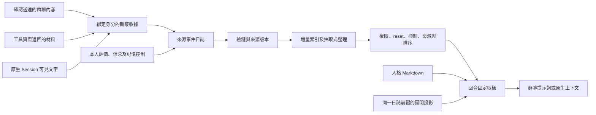

# Agent 身分與記憶架構

個人記憶歸屬於穩定的 `agentId`。房間保存共享工作，DSH Session 承載執行；同一 Agent 可以跨房間與 Session 延續人格、本人觀察和判斷。這份文件供維護者理解資料流、權威來源與恢復邊界。工具和配置見[記憶生命週期](memory-lifecycle.md)，部署與健康診斷見[維運指南](operations.md)，研究條件見[實驗與評測](experiments.md)。

## 領域模型與權威來源

| 物件 | 保存的內容 | 權威邊界 |
| --- | --- | --- |
| Agent | 穩定身分與名冊資料 | 顯示名稱、房間職務或 Session 不能替代 `agentId` |
| Participation | Agent 在房間的參與歷史與 Session 綁定 | 成員資格只允許檢查來源；可召回內容仍需觀察收據 |
| Persona | 使用者設定的人格 Markdown | 提供性格、習慣和背景；不授予權限或證明事實 |
| Room | 訊息、章程、台帳、投遞、回合及事件日誌 | 共享工作資料與各人的私有記憶分開 |
| Observation | 內容交給某 Agent，或由本人產生的收據 | 證明已記錄的接觸，不保證材料正確或涵蓋全部經歷 |
| Appraisal | 本人對另一人的立場、信心、主張與證據 | 由觀察者本人表達，可撤銷 |
| Belief | 本人根據原始觀察提出的目前解釋 | 保留支持證據，可修訂或撤回 |
| Derived memory | 索引、去重代表條目、排序和休眠狀態 | 由已驗證日誌重建，快取本身不授予讀取權限 |

Session 被另一身分復用時，歷史參與關係保留。房間內呼叫以當前參與關係解析身分；不帶房間的原生呼叫要求唯一綁定。存在多個候選身分時拒絕猜測，新的群組預設也不回寫歷史歸屬。

房間另有行為計數（原稱 **C 層**）與主觀評價投影（原稱 **A 層**）。前者從訊息、投遞、台帳等事件派生十項計數；後者保留每位觀察者的有效判斷。評價不反寫計數，也不自動改寫人格。

## 資料流與模組



| 模組 | 主要責任 |
| --- | --- |
| [agent-directory.js](../lib/agent-directory.js) | 身分、參與歷史、相容規則與評價可引用的證據 |
| [agent-persona.js](../lib/agent-persona.js) | 人格檔案、內容雜湊、版本留存及保存衝突 |
| [agent-memory.js](../lib/agent-memory.js) | 可見文字抽取、相容參考投影、reset 範圍及個人摘要 |
| [agent-memory-index.js](../lib/agent-memory-index.js) | 增量索引、本人歸屬、去重、控制與信念核驗、候選和快取額度 |
| [memory-lifecycle.js](../lib/memory-lifecycle.js) | 版本化配置、可逆衰減及完整召回回應的大小限制 |
| [room-journal.js](../lib/room-journal.js) | 狀態與審計提交、恢復排序、授權重驗及一致讀取 |
| [event-log.js](../lib/event-log.js) | 事件信封、雜湊鏈、head anchor、寫入意圖及已驗證視圖 |
| [relationship.js](../lib/relationship.js)、[experiment.js](../lib/experiment.js) | 房間投影、有效區間、回合取樣、配置指紋與觀測定義 |
| [room-store.js](../lib/room-store.js)、[index.js](../lib/index.js) | 服務編排、收據、工具、HTTP 與宿主提示詞鉤子 |
| [observation-coverage.js](../lib/observation-coverage.js)、[storage-capacity.js](../lib/storage-capacity.js)、[cold-log.js](../lib/cold-log.js) | 已知觀察缺口、寫入容量及可驗證冷檔 |

### 收據如何形成

| 入口 | 記錄範圍與時點 |
| --- | --- |
| 群聊投遞 | 確認到達後，記錄該次提示詞實際包含的訊息 ID；構造提示詞或 transport 接受請求尚不足以證明接收 |
| `chat_memory` | 實際返回的近期訊息、台帳、提案與章程 |
| `chat_read_document` | 實際返回片段、內容雜湊、行號與截斷資訊 |
| 本人群聊發言 | 本人提交的訊息，保留穩定作者身分 |
| 原生 Session 事件 | 插件收到的 `user/message`、`assistant/message`、`tool/result` 可見文字；活動群聊綁定當前接收者，其餘寫入該 Agent 的原生來源 |

兩個顯式材料讀取工具返回 `memoryReceipt`，說明收據是否寫成。原生抽取包含巢狀工具結果中的文字，排除工具參數、隱藏中繼資料、推理內容及圖片位元組。宿主動態上下文可以形成觀察，但本插件的注入區塊及已知個人查詢回傳會被排除，防止召回內容循環增加接觸紀錄。插件不追溯導入掛載前的全部原生歷史。

### 索引與可見性

每次讀取只選擇該 Agent 的歷史參與房間及專屬原生來源，再以本人收據篩選材料。事件的 `provenance.roomId` 必須與來源相符；缺少或衝突的標記不進入個人投影。知道證據 ID、參與過房間或命中快取，都不能取代觀察授權。

`RoomJournal.readEventView` 提供已驗證、不可變的全量來源或追加差量，版本含 `generation`、`count`、`head`。索引僅接受匹配基準版本的差量；替換、恢復、外部變動、淘汰或重啟後重新驗證和建立來源。暖讀仍檢查來源檔案與 head 的簽名。控制來源不可讀時採保守限制，避免其他快取復活已抑制材料。

背景整理與查詢共用同一索引。群聊固定來源前綴的查詢使用隔離投影，繼承其他已授權來源的控制與信念關係。索引與日誌快取各自有額度；淘汰不刪原始事件，也不構成整個 Node 程序的記憶體上限。排序、額度及回傳省略資訊見[召回規則](memory-lifecycle.md#召回與整理)。

## 人格、評價與目前信念

### 人格檔案

人格依 `agentId` 的 SHA-256 值存放在狀態目錄，與房間日誌分開：

```text
rooms.json
events/<roomId>.jsonl
events/<roomId>.jsonl.head
events/agent-observations-<SHA-256(agentId)>.jsonl
agents/<SHA-256(agentId)>/PERSONA.md
agents/<SHA-256(agentId)>/history/<舊內容雜湊>.md
```

人格上限為 8,000 個 UTF-16 碼元。首次讀取可建立待填模板，空模板不作已配置人格注入。保存需帶讀取時的 `expectedHash`；衝突返回 409，成功保存先按舊內容雜湊留檔，再以暫存檔替換目前版本。檔案為未加密的本地 Markdown，同進程有排序與版本檢查，沒有跨程序編輯鎖。

名冊編輯器及 `GET`／`POST /api/dsh-chat-local/agents/:id/persona` 供使用者管理。Agent 的 `chat_identity` 只讀本人資料。人格改動影響後續取樣與配置雜湊，已記錄的提示詞保留原樣。

### 評價與信念

`chat_appraise` 要求當前房間有效群聊回合，從執行 Session 解析觀察者。證據須來自本房間的本人觀察、本人署名訊息或本人評價；另一人的私有評價不可因知道 ID 而引用。跨房間記憶可以作背景，不能直接充當本房間評價的證據 ID。

評價按穩定觀察者與對象分隔，再重放有效區間。撤銷追加新事件，保留舊記錄。缺少穩定身分的舊評價只在歷史 Session 歸屬無歧義時作房間相容讀取，不自動進入跨工作記憶。自評和獨立驗收同樣按穩定身分判斷。

`chat_memory_update` 追加 `memory.control` 或 `memory.belief`。信念引用 1–8 份本人原始觀察，保存內容雜湊與收據 ID；修訂和撤回以明確 ID 關係重放，不依來源載入順序決定。再次看到相同內容仍可保留原支持；reset、來源替換、抑制或原收據消失時重新核驗。控制寫入本人原生來源；帶當前房間的信念寫入該房間，讓 episode 邊界同時約束讀寫。

## 回合取樣與注入

一次群聊回合固定一份房間日誌前綴，從中取得行為計數與本人評價，並取樣各參與者人格及個人記憶。成員的私人內容各自渲染；後發言者不因前者更新日誌而重取本回合樣本。治理門使用同次行為取樣，預設關閉，啟用後只能收緊既有權限。

| 注入內容 | 獨立上限 | 留存內容 |
| --- | --- | --- |
| 房間關係摘要 | 600 UTF-16 碼元 | 文本雜湊、字數、選取與省略資訊 |
| 本人經歷、評價與信念摘要 | 600 UTF-16 碼元 | 來源、證據、截斷與省略資訊 |
| 已配置人格 | 8,000 UTF-16 碼元 | 人格雜湊與注入字數 |
| 完整群聊提示詞 | 無上述三項合計的硬上限 | 原樣 `turn.prompt`、雜湊與長度 |

來源失敗會降低記憶可用性；可讀的人格仍可獨立提供。沒有可用或能放入預算的記憶時省略空標題。`personalMemory` 與 `appraisalDigest` 的作用範圍見[配置](memory-lifecycle.md#配置)。

支援 `systemPrompt` 服務的宿主透過 `system-prompt/assemble` 提供普通原生回合的同一人格與個人記憶，跳過活動群聊和歧義身分，並在同一回合復用取樣。缺少該服務的宿主仍可使用群聊與顯式工具。原生鉤子不產生群聊的 `turn.prompt`／`injection.cost` 實驗紀錄。

## 狀態提交、讀取與恢復

### 提交義務先持久化

`RoomJournal.commit` 捕獲狀態和確切審計內容，固定操作 ID，將兩者寫入格式 17 的狀態文件。尚未確認的操作保存在帶校驗值的 `_journal`。暫存檔同步、重命名及目錄同步後才發布事件；發布失敗保留義務，後續保存或啟動恢復重放同一內容，以 `appendOnce` 避免重複計數。確認檢查點使用最新已保存狀態，不能覆蓋較新的提交。

`EventLog` 的每房間隊列協調 read、append 和 replace。修改前保存帶校驗的 `.pending` 意圖，記錄確切事件、原字節前綴與目標；恢復只修復符合該意圖的部分寫入。公共讀取遇到未完成意圖拒絕返回，修復由明確寫入或啟動恢復路徑執行。損壞的恢復記錄或無法完成的已提交義務會阻止正常恢復完成。

### 讀取和授權重驗

`appendChecked` 等待恢復和本房間前項後，重新驗證房間物件、身分與回合授權；最終驗證到加入寫入隊列之間沒有 `await`。等待中的舊回合不能取得接任者或恢復後房間的權限。

`readEvents` 等待已開始的發布，並拒絕缺少已提交義務的結果；它不等待所有尚未發布的狀態保存，讓首個工具能讀到已持久化的提示詞收據。`readRoomMemory` 則等候狀態與審計工作穩定，從磁碟取得一致房間與日誌，跨過新提交時按 generation 重試。持續變動超過上限便返回錯誤，`snapshotRun` 使用此一致結果。

### 快照恢復

`runRestore` 在安裝暫態房間前作全域排序，同房間操作再經 `runRoom` 排序。恢復把目標狀態與完整日誌替換義務一起保存，有意取代該房間較舊的待發布操作。替換收據避免重啟後再次替換、覆蓋其後的新事件；替換等待門先釋放，再等候其餘審計，避免互相等待。低層入口拒絕未經協調的重疊恢復。

這些契約涵蓋單服務實例內的並行與進程中斷。外部模型接收和本地收據保存仍分屬兩個系統；寫入意圖持久化前的觀察可能遺失，既有漏記也無法補造。沒有跨程序鎖或對硬體斷電、控制器及網路檔案系統的完整保證。一般記憶來源不可讀可使召回返回 `partial`，不應與恢復記錄損壞混為同一種故障。備份和處置見[維運指南](operations.md)。

## reset、權限與隱私

`persistent` 使用累積窗口。`reset_per_episode` 在每個 `(run, 根訊息)` 追加一次 `memoryScope: "all"` 清除事件，重開房間計數與評價窗口，並將該條件下的個人召回限制為本房間、本 episode 之後的觀察。同根訊息重試不重複清除。

人工干預預設只影響行為計數；整房間 `clear` 加 `memoryScope: "all"` 才同時影響本人評價與該房間觀察窗口，不能再指定單一觀察者或對象。收據決定接觸時間，因此 reset 後重新讀到舊材料會形成新觀察。人格、共享訊息、DSH 原生上下文及其他來源歷史保留。快照恢復則有意丟棄選定快照之後的該房間狀態與事件，不覆蓋人格或其他房間。

當前房間權威日誌不可讀時，查詢保留房間範圍並標記 `authority: "unavailable"`，不回退到更寬的跨工作歷史。Agent 工具和提示詞只提供本人的私有內容。完整評價矩陣、人格管理 API 與狀態檔案面向本機管理者；HTTP 不認證本地呼叫者，能讀取狀態目錄的程序也能看到原樣提示詞和材料。雜湊鏈提供變更痕跡；能一起重寫日誌和 head 的人仍可重建自洽歷史。

## 驗證入口

| 契約 | 主要回歸檔案 |
| --- | --- |
| 提交、崩潰與恢復排序 | `persistence-contract`、`snapshot-restore`、`crash-recovery`、`resilience-journal` |
| 身分歸屬與私有觀察 | `agent-identity-history`、`personal-memory-integration`、`comprehensive-memory` |
| 索引、控制、信念與排序 | `agent-memory-index`、`memory-index-independent`、`memory-retrieval-priority`、`memory-lifecycle-service` |
| 人格檔案與宿主鉤子 | `agent-persona`、`resilience-persona`、`comprehensive-runtime` |

表內名稱對應 `test/<名稱>.test.js`。`npm run check` 執行完整檢查；可選宿主整合測試需設定 `DSH_MODULES_DIR`，缺少環境時明確跳過。受控故障與有限歷史規模測試提供可重跑證據；模型人格穩定性仍需獨立軌跡與人工評估，方法見[縱向人格試驗](persona-longitudinal.md)。
