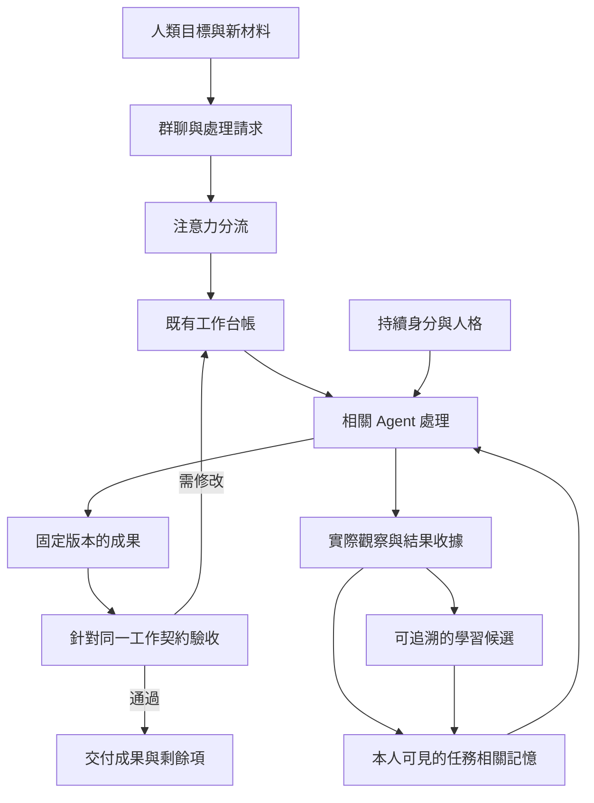

# 群聊協作下一版：結構化方案

狀態：保留的設計基準；實作與使用方式見 [工作流程](../collaboration-workflow.md)。日期：2026-09-28。程式基準：`8484fb1`。

本方案將 [GitHub 調研](2026-09-28-group-chat-github-study.md) 收斂成一條實作路線。目標是：**具有持續身分、各自經歷與觀點的 Agent，能共同完成可核查的工作，並從本人經歷中改進。** 此文件中的新增欄位、模組名稱與流程均為提案，不代表已上線。

## 1. 產品結構：人、工作、對話、成果、記憶

| 部分 | 回答的問題 | 權威記錄 | 下一版的責任 |
| --- | --- | --- | --- |
| 人 | 他是誰？有哪些持續的特點？ | 現有 agentId、PERSONA.md、人格歷史 | 身分跨工作延續；當次職務不改寫人格 |
| 工作 | 我們要完成什麼？誰負責？還欠什麼？ | 現有工作台帳 | 固定交付範圍、材料、標準、整合責任與依賴 |
| 對話與注意力 | 這句話讓誰需要做什麼？ | 群聊訊息、處理請求及投遞紀錄 | 分開通知、回應義務與實際觀察；控制喚醒 |
| 成果與驗收 | 做出了什麼？哪一版通過了哪些檢查？ | 現有 artifact registry、submission、review | 保存可取回的版本，綁定成品、依據與驗收標準 |
| 個人記憶 | 他看過什麼？怎樣理解？下次如何改進？ | 現有個人觀察、belief、appraisal、索引 | 按工作召回，增加有來源的學習候選與反證 |

群組是可重用的成員配置；聊天室是一次交流的場所；工作是可跨多輪推進的承諾。三者沿用現有模型，不互相替代。同一 Agent 可在一項工作當作者，在另一項工作當評審。整合者是一個當次職務，不是永久上級。

DSH 繼續負責模型、原生 Session、工具執行與審批。人格、群體共識或記憶均不新增工具權限。



## 2. 核心資料：補連接，不另建台帳

### 2.1 WorkItem：一項工作及其契約

保留 owner、reviewer、驗收標準、revision、blocker、submission 與 review。新增或明確化：

| 資料 | 用途與規則 |
| --- | --- |
| `contractHash` | 工作範圍、指定輸入、驗收標準及責任配置的指紋；普通評論不改此值 |
| `inputRefs` | 固定材料版本、證據引用或子工作提交版本，記錄此次採用什麼 |
| `requiredWorkIds` | 整合事項必須交代的子工作；不把原本僅供導航的 related 關係偷偷改成硬依賴 |
| `submission.artifactRefs` | 結構化 `{artifactId, versionId, contentHash}`；原 `deliverable` 保留作人類可讀說明 |
| `submission.coverage` | 哪些標準已滿足、哪些仍缺，以及缺項對結論的影響；不由「有交東西」推導全部完成 |

最終整合仍用一項普通 task 表示，由該 task 的 owner 負責交付，不新增另一套專案任務狀態。子工作可並行。整合時固定各子工作的實際提交版本，不只連到可變的 task ID。

`revision` 用於併發更新；`contractHash` 用於工作承諾是否改變。兩者不能互換：加一則 comment 可以增加 revision，卻不應自動讓所有驗收過期。

### 2.2 處理請求：誰欠一次處置

在房間中統一一份處理請求記錄，承接現有 handoff 的請求狀態，保存 `requestId`、`triggerEventId`、`workId`、`recipient`、`purpose`、`basisVersion`、`resolution` 及併發版本。這是待處理請求，不是第二份工作。message、task.handoff 和 Run 只引用 requestId 或呈現派生視圖，不各自保存可寫的處置狀態；投遞憑據仍描述傳輸結果，不能代替請求已處置。

- `purpose` 表達提問、執行既有工作、驗收、更正／異議、條件恢復。
- 同一請求重送，沿用原身分；狀態至少區分待派送、已派送、結果未知、已處置與失效。
- 回覆「不採納，理由與證據如下」也是處置；收到請求不代表其主張成立。
- 請求過期、被替代或相關工作取消時，停止舊派送，保留歷史。
- 普通訊息不必建立處理請求；仍保存原文，不用相似度刪除。

### 2.3 ArtifactVersion：可實際取回的交付物

延伸現有版本登記，保存不可變內容或可驗證、可取回的固定快照。只記路徑與 hash 不足以保證以後讀到原版本。成品可以是 Markdown、程式差異、測試結果或結構化答覆，並非所有工作都強制生成文件。

內容先可靠落盤，再經 RoomJournal 提交版本引用；引用成功前不宣稱發布完成。使用既有容量預留、校驗與恢復規則，避免為成品另造一套交易機制。跨步驟崩潰留下的未引用內容，核對後才能清理。

### 2.4 Review：驗收一個確切對象

在既有 `submissionRevision` 上補齊：

```text
驗收對象 = 工作契約 + 採用的輸入版本 + 提交版本 + 成品版本
驗收結果 = 各必要標準的判斷 + 支持證據 + 未解問題 + 評審身分
```

成品或正式採用的材料／標準改變後，舊驗收仍是歷史，不能覆蓋新契約。某文件出現新版，不自動否定對舊版的歷史判斷；介面顯示新版，明確記錄工作是否採用。模板需說清楚採固定版，還是要求交付前核對新版本。

多人評審可分別提交意見，最終判定仍依事先定義的驗收標準，不能以多數票覆蓋事實證據。第一版保留既有指定 reviewer 作最終驗收人，額外專家意見先用相關子工作承載，避免一次擴張整個 review schema。

### 2.5 Run：本次執行的安排

沿用現有 orchestration；保存階段、預算帳引用、處理請求 ID、目前納入事件範圍與停止原因。工作狀態仍讀取台帳，請求處置仍讀取唯一請求記錄，不在 Run 複製一份完成真相。

執行階段為：收集／工作 → 整合 → 驗收 → 本次停止。需要修改時，在剩餘預算內回到工作或整合。保留目前底層 endReason 的相容語義，另外向使用者呈現台帳導出的工作結果，避免把原「隊列跑完」重命名成「全部驗收完成」。

## 3. 訊息與喚醒決策表

同一入口使用兩種策略：**工作**按責任、依賴與驗收分流；**討論**由主持者發起有範圍、有收束條件的徵詢。切換策略不複製台帳，不清掉已有任務或驗收義務。

初始尚無工作責任人時，先由群組指定的協調者承接分流。舊房間未設定協調者時，建議依已保存成員順序選第一位可用成員作本次分流者，並在介面明示；其後由工作台帳固定實際交付責任。沒有可用者時顯示需要接手，不改成全員廣播，也不暗自提高任何人的權限。這是建議的預設策略，可由使用者調整。

| 收到什麼 | 系統如何處理 | 誰需要回應 |
| --- | --- | --- |
| 人類新要求或未分類文字 | 交目前責任人一次處理；連續輸入可合併 | 責任人；不要求全員回答 |
| 明確「僅告知」 | 保存為待讀增量，無立即生成回覆 | 無立即回覆義務；相關增量須在結案前處理 |
| 明確提問／請處理 | 建立具名請求，附工作與依據版本 | 指定接收人，未指定時由責任人接收 |
| Agent 普通進度、附和、引用別人 | 保存，必要時列入相關工作的待審閱增量 | 不因正文出現名字而新增義務 |
| 新證據、更正、正式異議 | 建待處置請求；涉及驗收時通知驗收人 | 相關負責人；須採納、反駁或列為待補證 |
| 「現在做到哪裡」 | 先呈現台帳及成品；需解釋時才喚醒整合者 | 整合者一次回報 |
| 缺件或待決策 | 關聯共同 blocker，指明解除人與條件 | 能解除者收到一次請求，其他人等待 |
| 阻斷條件確實變更 | 先核對條件，再用既有 handoff 恢復 | 受影響工作的負責人 |
| 明確要求大家提出不同觀點 | 一次有範圍的徵詢，收集答覆或略過 | 受邀者；完成後由主持者彙整分歧 |

自然語言分類只提出用途與接收人建議；不能批准外部行動、增加權限或把尚未處理的訊息標成已知。對 Agent 工具呼叫優先採結構化用途；舊客戶端的歧義輸入交責任人處理，不自動廣播全組。

**未喚醒的人不會自動理解新訊息。** 未標記的普通文字可能含重要異議，不能承諾零模型處理又一定辨識。相關文字保留在待審閱增量，整合者在工作節點與結案前處理本次範圍；若只讀摘要，記錄摘要暴露，不能聲稱原文全讀。無人可處理或預算不足時，明示「尚未審閱」。

明確更正／異議不得由 owner 以「沒有進展」直接抹除；每個處置留下原因與來源。新異議也不授予無限回合：不能及時核查時列為未解，限制交付結論。

## 4. 三種狀態分開

| 狀態 | 回答的問題 | 關鍵規則 |
| --- | --- | --- |
| 工作狀態 | 承諾完成了嗎？ | 沿用 open、in_progress、blocked、in_review、done，以及既有暫停／取消／歸檔 |
| 執行狀態 | 這次還會繼續跑嗎？為何停止？ | 排程空、等待、預算耗盡、失敗、中斷、取消分開；停止不改寫驗收結果 |
| 驗收有效性 | 現在使用的契約和成品有有效驗收嗎？ | 按確切版本判斷；歷史通過不表示目前通過 |

一般 task 的主流程：

```text
待處理 → 處理中 ⇄ 受阻
           ↓
         待驗收 → 已完成
           ↓ 退回
         處理中
```

decision／dispute 延用自己的現有規則，不套入 task 的完成流程。取消和歸檔也不能冒充通過驗收。

整合工作只有在必要成果與檢查齊全、相關請求已處置、現行驗收有效時才能完成。結案固定納入的事件範圍，在同一 RoomJournal 提交範圍中核對契約、請求版本與事件截止點；其間有相關新事件則拒絕過期結案，先處理或標為未解。交付後到達的新材料顯示為新事件，可提出複核，不默默改寫舊交付，也不自行重啟已取消的工作。

**部分交付是交付範圍，不是完成捷徑。** 先提供可用成品、缺項及影響；若原標準要求全部完成，台帳保持未完成。只有原契約容許部分交付，或使用者明確調整範圍／標準，才可依新契約驗收。

## 5. 預算、重複與中斷

| 問題 | 固定規則 |
| --- | --- |
| 普通討論用盡所有額度 | 從同一總額預留整合與驗收份額；同時保留整合者／評審的個人回合額度 |
| 剩餘額度不足以返工 | 不再展開一輪全員討論；交付當前版本、未解項與停因 |
| 連最後總結的模型額度都沒有 | 用已保存的結構資料呈現結果；不冒稱完成模型整合 |
| 相同交接重送 | 沿用 operation/request ID；新證據即使文字相同也保留 |
| 相同 blocker 一直未變 | 不重新派工；主動時間提醒僅依明確啟用的監控策略 |
| 改措辭／改排版冒充進展 | hash/revision 只證明內容變化；普通 comment 不延後停滯，進度對照驗收項與依據 |
| 負責人失聯 | 保留舊契約、成果與驗收歷史；正式更換 owner 產生新契約，由接手者收悉並核對可沿用成果。僅代執行且原 owner 責任不變時不改契約；無可用者就顯示需要接手 |
| 派送後崩潰，結果未知 | 核對原操作與原 Session；外部副作用靠冪等鍵或結果核對，無保障時不盲目重試 |

預留份額使用可配置的工程初值，先用歷史案例與成本記錄校準；不在未測量前宣稱某個固定輪數最合適。上限仍存在，任何策略都不能自行擴大使用者授權或總預算。

預算帳以同一執行鏈的穩定 ID 保存。派送前預扣執行額度並保存憑據；已喚醒模型便計入，包含 `(pass)`、分類／規劃呼叫及模型重試。只有能確認未執行的派送才可釋放預扣，崩潰或逾時而結果未知時不補回。可見回覆數另計，不能冒充模型次數或 token 成本；宿主未提供用量時標示未知。

內部 handoff、重新排程與恢復沿用原預算帳，不因新的 rootMessageId 重置。新的使用者工作請求或續跑指示可建立有記錄的新額度；純狀態查詢不補充舊工作的預算。全鏈與每人額度均要為整合／驗收保留份額。

## 6. 個人記憶如何結構化

| 內容 | 沿用的基礎 | 下一版增量 |
| --- | --- | --- |
| 人格：我是怎樣的人 | PERSONA.md、版本與歷史 | 保留使用者管理核心人格；工作方法不塞進人格 |
| 經歷：我實際接觸了什麼 | 觀察收據、作者身分與原始事件 | 轉述／摘要／學習明示原始來源關係，防止證據膨脹 |
| 信念：我目前如何理解 | belief、supersedes、撤回 | 適用範圍、語義有效期、反證、needs_review |
| 方法：下次應怎麼做 | 共用既有來源核驗與召回限制 | 新增少量 lesson 候選：條件、做法、來源、反例與採納狀態 |
| 關係：我如何看待某人 | appraisal、信心、證據、撤銷 | 限定合作情境；不轉成通用信任分數或權限 |
| 承諾：我還欠哪些工作 | 權威仍為共享工作台帳 | 個人只保存 task／契約引用；使用前讀現行狀態，不另存第二份完成狀態 |

每次喚醒的順序：**確定此次問題與責任 → 取得當前可見來源／版本 → 召回相關經歷、支持與反證 → 在預算內提供上下文 → 執行 → 保存實際結果。** 無相關內容時允許空摘要；查不到不等於從未經歷。

學習流程：使用者更正／驗收失敗／已確認結果觸發候選 → 程式檢查來源及非循環 → 核對內容與適用範圍 → 本人採納為當前方法或拒絕 → 新反證到來後重查、修訂或撤回。本人採納表示目前選擇使用，不表示已證明普遍正確。人格核心修改仍走使用者管理流程；無新增資訊不生成反思工作，不發一輪「我已反思」群消息。

第一步先改當前工作導向召回；第二步才加入 lesson 候選。物理刪除／保留期治理獨立設計，現有 suppress 仍表示停止召回，不能改名叫刪除。

### 評審和持續記憶的衝突如何處理

評審開始時固定材料與可用記憶來源快照、知識截止點及盲評條件。首次提交前不提供同輪其他人的評語；提交後再互相討論。

**已經看過，不能靠停止注入假裝沒看過。** 若 Agent 在其他房間或原 Session 已看到答案，將此次標為非盲評。獨立 Session 可隔離這次上下文，不能消除既有經歷。檢測只能基於已記錄的觀察與宿主可確認的上下文；不能證明沒有未知接觸，因此保留「暴露情況不完整」標記。需要全新觀察者的實驗應明確使用新 Agent，不把他冒充原來那個人。

## 7. 程式結構與改動位置

以少數 Module 集中規則，透過同一 Interface 供工具、HTTP、排程及測試使用。新檔名為建議名稱，實作時按抽取結果決定；不為檔案數量建立只轉呼叫的空層。

| Module | 小而一致的 Interface | 吸收的責任與現有位置 |
| --- | --- | --- |
| 協作分流 | 對已保存的事件及工作快照提出下一步安排，回傳接收人、理由與依據版本 | 從 room-store 的 recipients、mentions、review 排程與催促條件抽出一致規則；可用 `collaboration-policy.js` 承載 |
| 工作協議 | 接受建立、進度、提交、驗收、交接等命令，統一核驗及提交 | 延伸 work-protocol／room-store 的既有流程；所有入口共用契約，不讓 UI 自行解讀完成 |
| 成果版本 | 發布指定工作成果、讀取確切版本 | 延伸 artifact registry、preview／document 能力，集中內容快照、校驗、容量與版本引用；可用 `artifact-versions.js` 承載 |
| 個人上下文 | 依 Agent、當前工作與可見來源快照選取上下文，回傳來源與省略原因 | 串接 agent-memory-index、memory-lifecycle、persona，避免各注入路徑各自排序；可用 `personal-context.js` 承載 |
| 存取與恢復 | 使用既有 RoomJournal、身分解析與 DSH 執行契約 | 保持現有權限、事件提交和觀察收據；不再引進第二個排程／儲存框架 |

分流產出的安排不直接執行工具。提交／派送前重查契約、回合與來源版本；已變動就重算，不能使用過期快照。`room-store.js` 保留房間協調責任，逐段把分散規則移到上述 Interface；先做一條完整流程，避免同時重寫整個檔案。

## 8. 使用者介面

維持群聊主畫面，提供四個直接可讀的位置：

1. **對話**：溝通、提問、更正；普通輸入預設交責任人，明確提供「僅告知」「請處理」「更正／異議」入口，不要求填 schema。
2. **工作概況**：誰負責、等什麼、尚未審閱幾項、本次為何停止；狀態由權威記錄導出。
3. **最新成果**：當前版本、修改摘要、驗收對象與結果、未解問題，能打開舊版對照。
4. **成員詳情**：持續身分與人格；個人記憶沿用既有可見性，群組面板不把私人信念或評價公開給其他 Agent。

最終顯示至少區分「已驗收」「已交部分成果」「等待條件」「預算耗盡」「執行結果未知」。詳情保留依據，不以綠色 idle 圖示暗示任務完成。

## 9. 分期與依賴：每期都有可交付的結果

| 工作包 | 交付 | 依賴 | 必要驗收 |
| --- | --- | --- | --- |
| W1 契約與相容資料 | inputRefs、contract、整合 task 及舊資料讀取規則 | 無 | comment 不使驗收失效；契約改變必須重驗 |
| W2 訊息與處理請求 | 統一用途、路由、防重、待審閱增量、共同 blocker 提醒 | W1 | 通知不喚醒全員；新異議不遺漏；重送不重複處理 |
| W3 成果與驗收連接 | 固定內容版本、submission/review 結構化引用 | W1，可與 W2 並行 | 精確讀回舊版；成品或採用依據改變後舊批准不覆蓋新版 |
| W4 完整合作流程 | 整合預算、交接、部分交付、結案事件範圍與工作概況介面 | W2＋W3 | 後到更正可處置；到上限仍有成果／缺項；不誤報完成 |
| W5 任務導向記憶 | 工作上下文召回、來源說明、評審快照與暴露標記 | W1，接入 W4 | 不跨人串入；相關經驗可找到；不虛構盲評 |
| W6 有來源的學習 | lesson 候選、採納／拒絕、反證與 needs_review | W5 | 無增量不寫；轉述不增證據；撤回內容不復活 |
| W7 對照與縱向評估 | 合作品質、成本及人格／方法延續報告 | W4；W5／W6 分別加入對照 | 保留失敗與變異；工程通過和模型效果分開報告 |

**第一個可發布版本：W1–W4。** 目標是把一次多人工作從開始帶到可查驗交付，重播兩個歷史失敗案例。介面與測試隨工作包一起完成，不留到最後。

**第二個可發布版本：W5–W6。** 目標是記憶更貼近當前責任，能留下可修正的工作方法；不自動改人格核心。

**W7 是兩版的品質門檻與後續縱向工作。** 先完成工程驗收，再受控啟用真實模型試跑；功能可用不等於已證明合作增益。自主社交、制度演化與心理模擬另立目標，暫不混入這兩版。

## 10. 驗證、遷移與回退

### 工程驗收

必測：重複交接、延遲回覆、新版材料、評論與契約版本差異、整合者耗盡額度、共同 blocker、普通訊息藏有更正、首輪評審暴露、取消後舊記憶、來源失效，以及成品寫入／投遞後回執未保存的崩潰窗口。測試跨正式 Interface，核對磁碟與重開後狀態，不只 mock 返回成功。

完成判定需要證據：新資料契約與型別一致；相應回歸及必要整套檢查通過；實際 DSH 路徑的通知、喚醒、結果回收和上下文注入已抽查。沒有執行的檢查必須保留未驗證標記。

### 品質驗收

用固定材料和相同總預算，分別比較單 Agent／現行群聊／改進群聊，再比較無長期記憶／現行記憶／改進記憶。分開兩個因素，避免同時換所有條件後無法歸因。先做試驗估計變異，再事先定義主要指標、容許退步範圍與所需樣本；不憑任意輪數宣布勝出。

優先看正確性、重要遺漏、可驗收完成與異議處置，再看救場次數、成本、耗時和重複負擔。使用未參與調整規則的新任務，對內容安排可核查答案與盲評抽查。短期成品改善與長期人格穩定分開報告。

### 資料與切換

- 舊 agentId、人格、記憶收據、台帳及事件保持原身分；新資料增量遷移。
- 舊的文字型交付保留並標「版本未固定」，不補造 artifact 或驗收證明。
- 同一房間同一時刻只有一個派送策略生效；策略版本保存於執行紀錄。新舊規則比較先使用不派送的計算結果，不能開兩套流程同時叫模型。
- 先在隔離 fixture 與受控房間驗收，再擴大啟用；切換時沒有進行中的派送，未知結果先核對。
- 第一種回退是在新版本程式中停用新分流策略、保存可讀的新資料。二進位降版須另驗證 schema 相容性或使用已核對的備份，不能讓舊程式直接改寫不理解的新欄位。

## 11. 用論文評估群聊走一遍

使用者說：「幫我評估投稿，給出評分與一份 MD。」

1. 當前責任人建立整合 task，記錄目標、已採用材料、評分依據、MD 交付與驗收條件；該記錄在工作概況可見。
2. 只對需要的專業工作發請求，例如方法、證據與文獻；成員按自己責任取得材料與相關個人經驗。
3. 發現共同缺件時，建立一個相關待辦；其他可進行的分析繼續，不要求每人重述缺件理由。
4. 整合者發布報告 v1；群裡只說新增判斷與未解問題。若關鍵資料不足，明確標為初步評估，不假裝完整結論。
5. 評審針對 v1、指定材料與標準提出具體問題；修訂成 v2 後重新驗收相應契約。已受他人意見影響的評審不標為盲評。
6. 通過則交付確切版本；未通過而預算用盡，交付目前版本、缺項與停因，工作保持未完成。
7. 每人保存本人實際看過的內容；有來源的錯誤更正可形成個人方法候選，不把全組經歷灌給所有人。

這條流程是第一版的完整驗收主線；後續功能都應能說清楚它改善了哪一步，以及用什麼證據確認。
